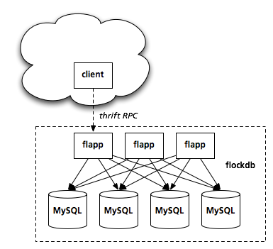

# Introducing FlockDB

Twitter's interest graph is the network of relationships between people: who you're following, who's
following you, who you receive phone notifications from, and so on.

Early on, we decided to handle these relationships a little differently. Instead of requiring a
siren to confirm her friendship with Odysseus, we let Odysseus follow the siren in a "one-way"
relationship. There's also no limit to how many people are allowed to follow you, so one user can
have millions of followers. Unfortunately, these decisions also made it difficult to scale as we
grew.

## A valiant effort

To deliver a tweet, we need to be able to look up someone's followers and page through them rapidly.
But we also need to handle heavy write traffic, as followers are added or removed, or spammers are
caught and put on ice. And for some operations, like delivering a mention, we need to do set
arithmetic like "who's following both of these users?"

We went through several storage layers in the early days, including abusive use of relational tables and key-value storage of denormalized lists. They were either good at handling write operations or good at paging through giant result sets, but never good at both.

A little over a year ago, we could see that we needed to try something new. Our goals were:

- Write the simplest possible thing that could work.

- Use off-the-shelf MySQL as the storage engine, because we understand its behavior. Give it enough
  memory to keep everything in cache.

- Allow for horizontal partitioning with a lookup table.

- Allow write operations to arrive out of order or be processed more than once. (Allow failures to
  result in redundant work rather than lost work.)

FlockDB was the result. We've been using it exclusively for about 6 months now.

## A valiant-er effort

FlockDB stores graphs as sets of edges between nodes identified by 64-bit integers. For a social
graph, these node IDs will be user IDs, but in a graph storing "favorite" tweets, the destination
may be a tweet ID. Each edge is also marked with a 32-bit position, used for sorting. (Twitter puts
a timestamp here for the "following" graph, so that your follower list is displayed latest-first.)

It isn't meant to be a graph database of the type that optimizes for graph-walking queries. Instead,
it optimizes for very large adjacency lists, fast reads and writes, and page-able set arithmetic
queries. We currently store over 13 billion edges and sustain peak traffic of 20k writes/second and
100k reads/second.

The app servers (affectionately called "flapps") are written in scala, are stateless, and are
horizontally scalable. We can add more as query load increases, independent of the databases. They
expose a very small thrift API to clients, though we've written [a ruby
client](http://github.com/twitter/flockdb-client) with a much richer interface.

We use [gizzard](http://github.com/twitter/gizzard) to handle the partitioning layer, so a
forwarding table maps ranges of source IDs to physical databases, and replication is handled by
building a tree of such tables under the same forwarding address. Write operations are acknowledged
after being journalled locally, so that minor database problems are decoupled from website response
times.

## Lessons learned

Some helpful patterns fell out of our experience, even though they weren't goals originally:

- **Use aggressive timeouts to cut off the long tail.**

  You can't ever shake out all the unfairness in the system, so some requests will take an
  unreasonably long time to finish -- way over the 99.9th percentile. If there are multiple
  stateless app servers, you can just cut a client loose when it has passed a "reasonable" amount of
  time, and let it try its luck with a different app server.

- **Make every case an error case.**

  Or, to put it another way, use the same code path for errors as you use in normal operation. Don't
  create rarely-tested modules that only kick in during emergencies, when you're least likely to
  feel like trying new things.

  We queue all write operations locally (using kestrel as a library), and any that fail are thrown
  into a separate error queue. This error queue is periodically flushed back into the write queue,
  so that retries use the same code path as the initial attempt.

- **Do nothing automatically at first.**

  Provide lots of gauges and levers, and automate with scripts once patterns emerge. FlockDB
  measures the latency distribution of each query type across each service (MySQL, Kestrel, Thrift)
  so we can tune timeouts, and reports counts of each operation so we can see when a client library
  suddenly doubles its query load (or we need to add more hardware).

  Write operations that cycle through the error queue too many times are dumped into a log for
  manual inspection. If it turns out to be a bug, we can fix it, and re-inject the job. If it's a
  client error, we have a good bug report.

## Check it out

The source is in github: [http://github.com/twitter/flockdb](http://github.com/twitter/flockdb)

In particular, check out the demo to get a feel for the kind of data that can be stored and what you
can do with it:
[http://github.com/twitter/flockdb/blob/master/doc/demo.markdown](http://github.com/twitter/flockdb/blob/master/doc/demo.markdown)

Talk to us on IRC, in #twinfra (irc.freenode.net), or join the mailing list:
[http://groups.google.com/group/flockdb](http://groups.google.com/group/flockdb)
